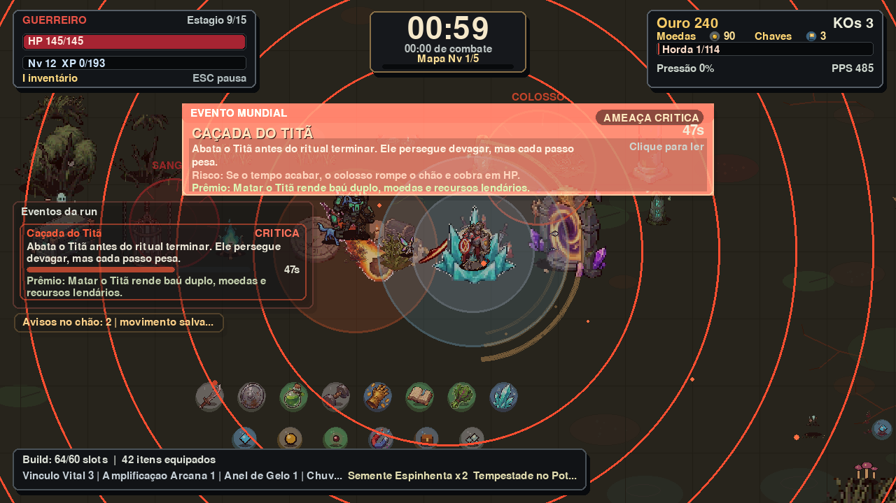
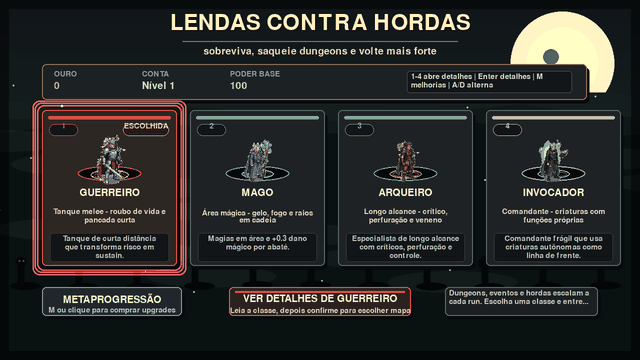
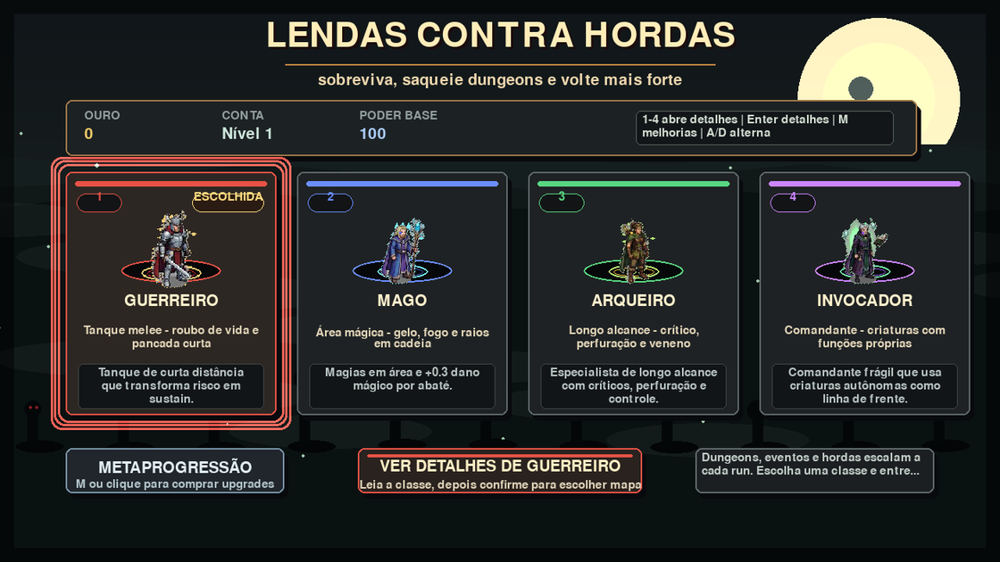
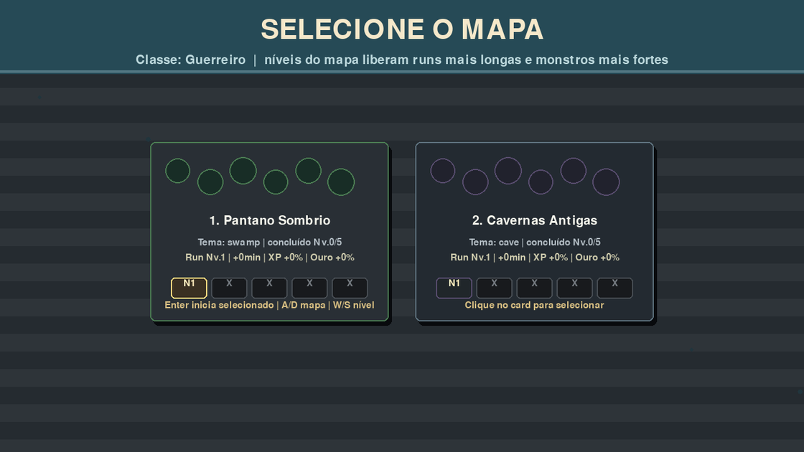
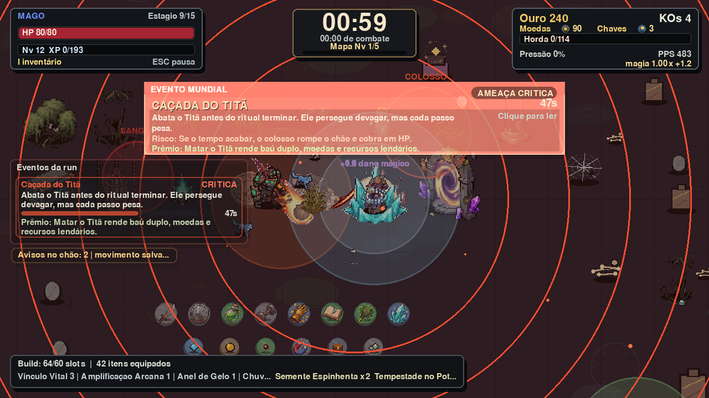
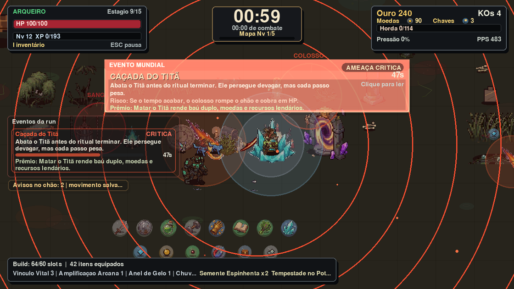
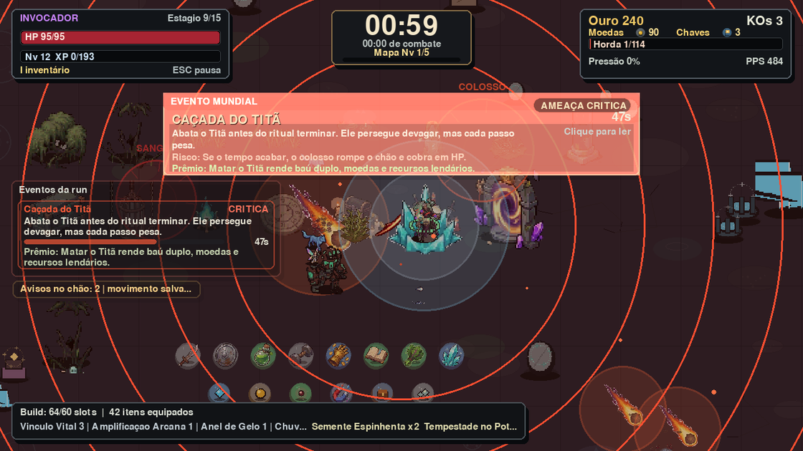
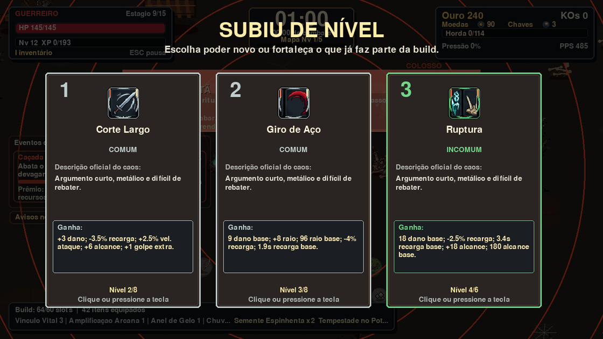
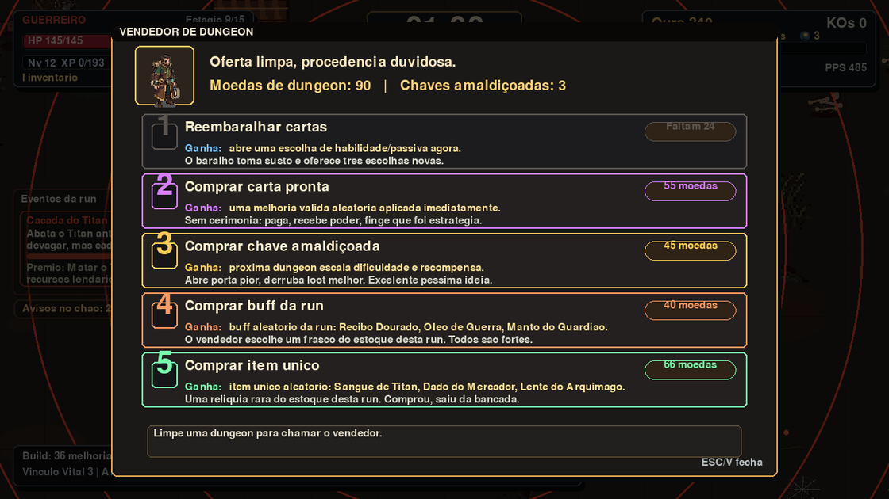

# Lendas contra Hordas




**Lendas contra Hordas** é um RPG survivors-like para Windows, com combate
contra hordas, classes com identidade própria, eventos mundiais, dungeons,
progressão permanente e criaturas titânicas.

Este repositório é uma **vitrine pública** do jogo. Ele mostra o projeto,
prints, GIFs, notas e informações de download, mas o código-fonte completo e os
documentos internos de design continuam privados.

## Versão Atual

**Versão pública atual: 1.1**

Esta versão melhora a leitura e o ritmo da run, com saída de dungeon mais fácil
de localizar, Berserker mais inteligente, limite de build em 60 slots únicos e
mais proteção para as lendárias da classe.

## Preview



## Galeria

| Menu | Seleção de mapa |
| --- | --- |
|  |  |

| Guerreiro | Mago |
| --- | --- |
|  |  |

| Arqueiro | Invocador |
| --- | --- |
|  |  |

| Level-up | Vendedor |
| --- | --- |
|  |  |

## O que o jogo tem

- Combate em tempo real contra hordas.
- Classes com habilidades e passivas próprias.
- Dungeons e eventos mundiais com riscos e recompensas.
- Monstros comuns, épicos, lendários e titânicos.
- Itens, melhorias permanentes, vendedor e progressão entre runs.
- HUDs, efeitos, sprites e áudio pensados para leitura rápida em combate.

## Download

### Download rápido

Baixe a build pública mais recente aqui:

```text
https://github.com/Leninn-Marinho-Rodrigues/lendas-contra-hordas/releases/download/v1.1/LendasContraHordas-Windows-v1.1.zip
```

### Como baixar e jogar

1. Clique no link de download acima.
2. Aguarde o arquivo `.zip` baixar. Ele tem cerca de 412 MB.
3. Clique com o botao direito no arquivo baixado e escolha **Extrair tudo**.
4. Abra a pasta extraida.
5. Dê dois cliques em `Jogar Lendas Contra Hordas.lnk`.
6. Se o atalho não abrir no seu Windows, execute `LendasContraHordas.exe`.

Se o Windows mostrar aviso do SmartScreen, clique em **Mais informacoes** e
depois em **Executar mesmo assim**. Isso pode acontecer porque a build de teste
ainda nao possui assinatura digital.

### Como atualizar sem perder progresso

1. Baixe o `.zip` da versão nova.
2. Extraia em uma pasta nova, por exemplo `LendasContraHordas-v1.1`.
3. Abra pelo atalho `Jogar Lendas Contra Hordas.lnk`.
4. O save local fica fora da pasta do jogo, em `Saved Games\LendasContraHordas`.
5. Por isso, atualizar a pasta do jogo não deve apagar seu progresso.

### O que vem na pasta do jogador

A pasta baixada foi organizada para ser simples:

```text
LendasContraHordas.exe
Jogar Lendas Contra Hordas.lnk
LEIA-ME.txt
app_icon.ico
```

Não é necessário instalar Python, abrir terminal ou baixar arquivos paralelos.

### Baixar pela pagina de Releases

Tambem da para baixar pela pagina da release:

```text
https://github.com/Leninn-Marinho-Rodrigues/lendas-contra-hordas/releases/tag/v1.1
```

Nessa pagina, abra a area **Assets** e baixe:

```text
LendasContraHordas-Windows-v1.1.zip
```

## Controles

| Ação | Teclas |
| --- | --- |
| Movimento | WASD ou setas |
| Escolher melhoria | 1, 2, 3 ou clique |
| Pausar / menu | Esc |
| Inventário | I |
| Interagir | E |

## Feedback dos jogadores

Se voce testar o jogo, seu feedback ajuda muito.

### Como enviar feedback pelo GitHub

1. Entre na pagina de feedback:

```text
https://github.com/Leninn-Marinho-Rodrigues/lendas-contra-hordas/issues
```

2. Clique no botao verde **New issue**.
3. Escolha um modelo:

- **Playtest feedback**: conte como foi sua experiencia jogando.
- **Bug report**: relate travamentos, erros, textos cortados ou sprites estranhos.
- **Sugestao**: mande ideias de habilidades, monstros, balanceamento ou melhorias.

4. Preencha os campos do modelo.
5. Se puder, anexe print ou video curto arrastando o arquivo para a caixa de texto.
6. Clique em **Submit new issue**.

### O que escrever no feedback

O feedback mais util costuma responder:

- qual classe voce jogou;
- quanto tempo sobreviveu;
- se o jogo ficou facil, dificil ou confuso;
- se algum texto ficou cortado;
- se algum sprite, som ou efeito pareceu estranho;
- prints ou videos curtos, se puder mandar.

Exemplo simples:

```text
Joguei de Mago por 9 minutos no mapa inicial.
Gostei das magias e dos efeitos, mas achei a dungeon comum dificil cedo demais.
O texto do evento ficou um pouco grande na tela.
Nao travou no meu PC.
```

Guia completo:

```text
https://github.com/Leninn-Marinho-Rodrigues/lendas-contra-hordas/blob/main/docs/como-dar-feedback.md
```

## Apoie o projeto

Lendas contra Hordas esta sendo feito por uma pessoa so, no tempo livre. Se
voce gostou do projeto e quiser ajudar a manter as atualizacoes, pode apoiar via
Pix:

```text
leninn.works@gmail.com
```

Qualquer apoio ajuda com tempo de desenvolvimento, testes, arte, audio,
ferramentas e futuras builds.

## Status

Projeto em desenvolvimento ativo. As imagens mostram uma build funcional, mas
nomes, balanceamento, efeitos, interface, sons e progressão podem mudar.

## Proteção do projeto

Este repositório não é open source. A vitrine foi montada para mostrar o jogo
sem entregar a implementação completa. Veja [NOTICE.md](NOTICE.md) e
[LICENSE.md](LICENSE.md).

## Links

- [Release notes](RELEASE_NOTES.md)
- [Press kit](docs/press-kit.md)
- [Publicação e proteção](docs/protecao-e-publicacao.md)
- [Roadmap público](docs/roadmap.md)
