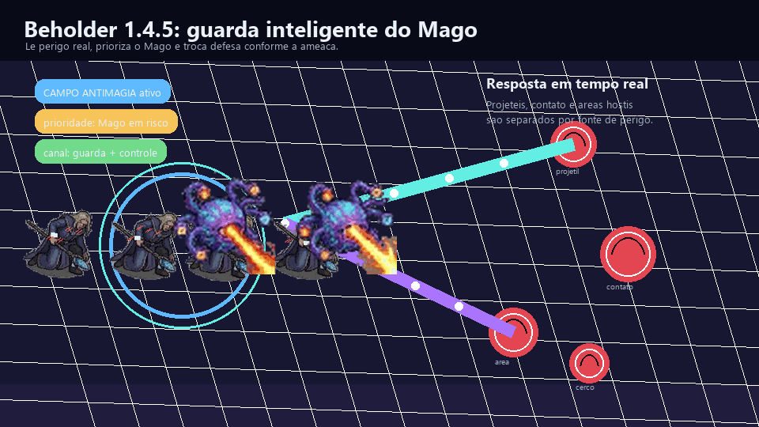
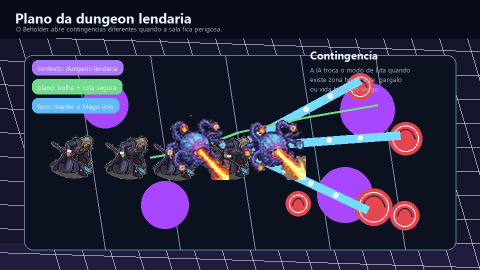
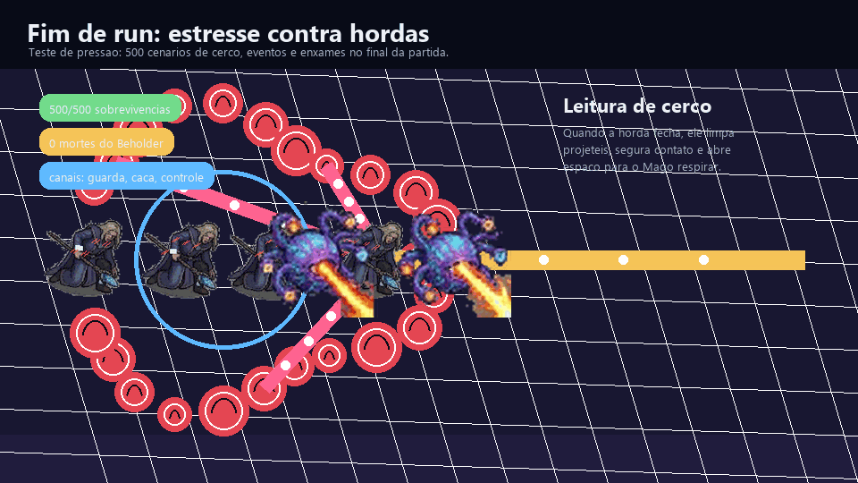
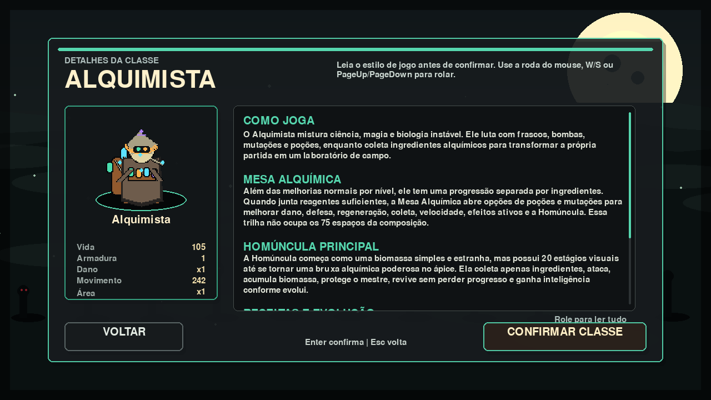
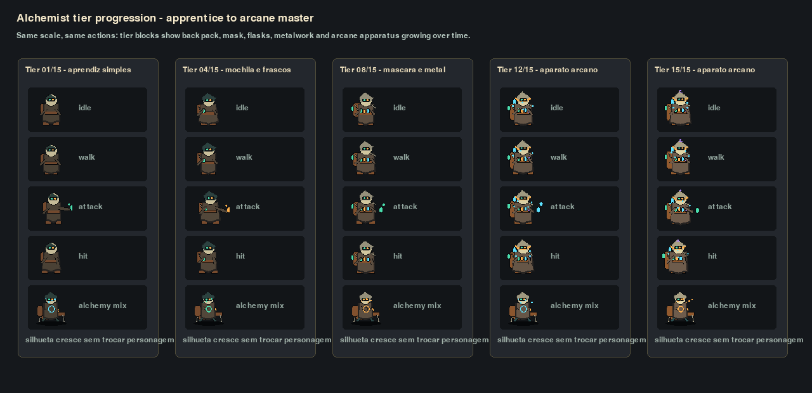
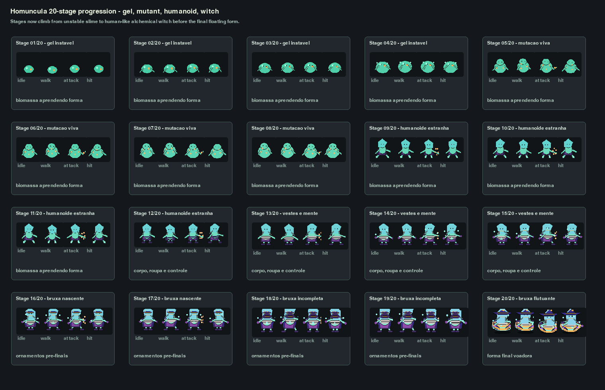
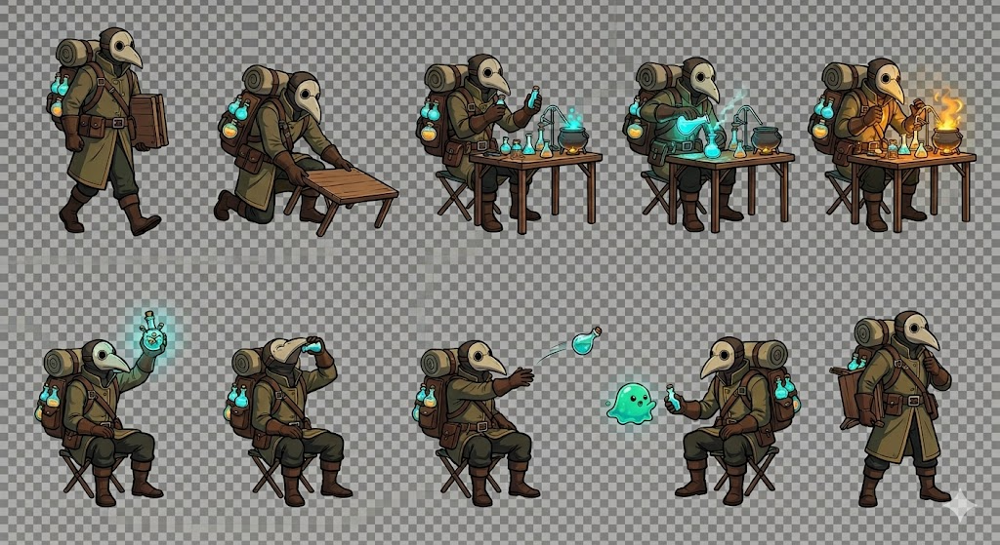
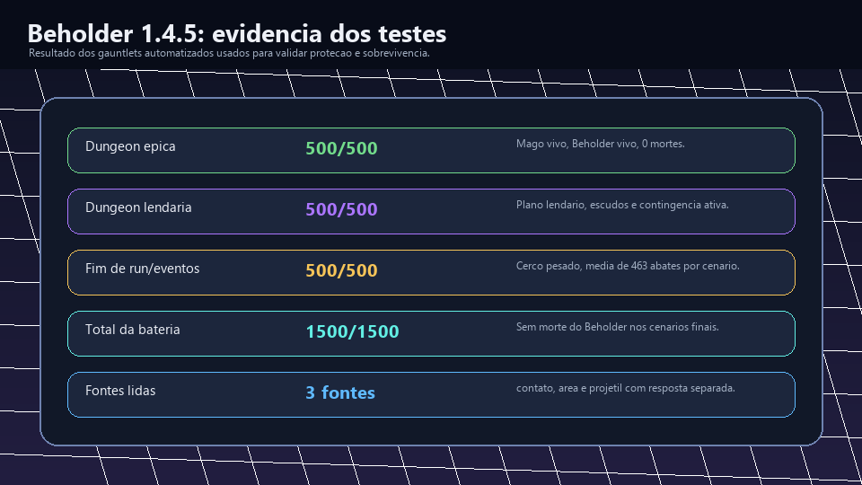
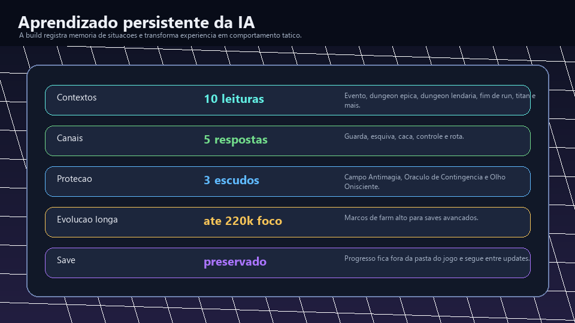
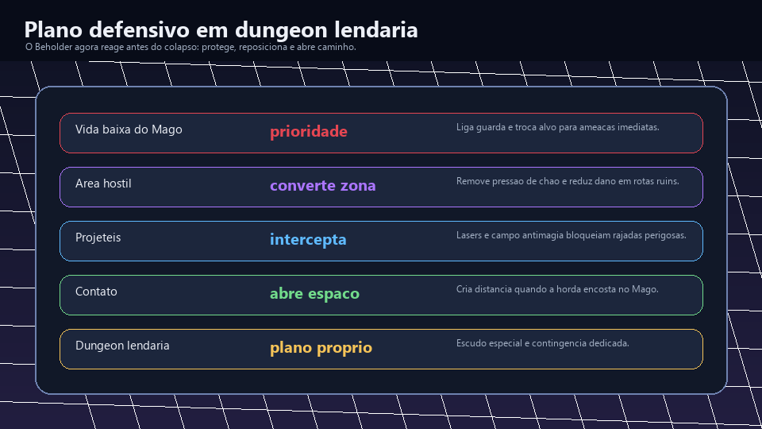

# Lendas contra Hordas


**Lendas contra Hordas** é um RPG survivors-like para Windows, com combate
contra hordas, classes com identidade própria, eventos mundiais, dungeons,
progressão permanente e criaturas titânicas.

Este repositório é uma **vitrine pública** do jogo. Ele mostra o projeto,
prints, GIFs, notas e informações de download, mas o código-fonte completo e os
documentos internos de design continuam privados.

## Versão Atual

**Versão pública atual: 1.5**

Esta versão adiciona a classe **Alquimista** como uma nova forma de jogar. Ele
continua usando a progressão normal por nível, mas ganha também uma camada única
de ingredientes e Mesa Alquímica: ao coletar reagentes na partida, o jogador prepara
poções, mutações e melhorias para si mesmo e para a Homúncula.

### O que mudou na 1.5

- **Nova classe jogável: Alquimista:** frascos, bombas, mutações, poções e
  alquimia mágica em uma classe flexível de dano, defesa, recursos e suporte.
- **Mesa Alquímica:** ingredientes coletados durante a partida abrem um menu
  próprio de receitas que não ocupa os espaços normais da composição.
- **Homúncula evolutiva:** a parceira do Alquimista coleta apenas ingredientes,
  ataca, protege o mestre, acumula biomassa, revive sem perder progresso e
  escala por receitas.
- **Árvore de receitas da Homúncula:** Tecido Reforçado, Núcleo Faminto,
  Membrana Guardiã, Mãos Alquímicas, Síntese Dupla, Instinto Protetor, Ritual de
  Renascimento e Mimetismo Mutagênico.
- **Sprites novos validados:** Alquimista ganhou estágios visuais de evolução e
  a Homúncula recebeu 20 estágios, do gel instável inicial até a forma final
  arcana.
- **Cards de heróis reescritos:** o menu de personagens agora explica melhor o
  estilo, pontos fortes, riscos e mecânicas centrais de cada classe.
- **Save preservado:** a versão continua usando o sistema de save fora da pasta do
  jogo, com busca e mescla de progresso antigo para não apagar conquistas.

## Preview








## Galeria

| Menu | Seleção de mapa |
| --- | --- |
|  |  |

| Guerreiro | Mago |
| --- | --- |
|  |  |

| Arqueiro | Invocador |
| --- | --- |
|  |  |

| Level-up | Vendedor |
| --- | --- |
|  |  |

| Invocações lendárias |
| --- |
|  |

| Novidades 1.5 |
| --- |
|  |
|  |
|  |
|  |

| Novidades 1.4.5 |
| --- |
|  |
|  |
|  |

| Novidades 1.4.1 |
| --- |
|  |
|  |
|  |

## O que o jogo tem

- Combate em tempo real contra hordas.
- Classes com habilidades e passivas próprias.
- Dungeons e eventos mundiais com riscos e recompensas.
- Monstros comuns, épicos, lendários e titânicos.
- Itens, melhorias permanentes, vendedor e progressão entre runs.
- HUDs, efeitos, sprites e áudio pensados para leitura rápida em combate.

## Download

### Download rápido

Baixe a build pública mais recente aqui:

```text
https://github.com/Leninn-Marinho-Rodrigues/lendas-contra-hordas/releases/download/v1.5/LendasContraHordas-Windows-v1.5.zip
```

### Como baixar e jogar

1. Clique no link de download acima.
2. Aguarde o arquivo `.zip` baixar. Ele tem cerca de 440 MB.
3. Clique com o botão direito no arquivo baixado e escolha **Extrair tudo**.
4. Abra a pasta extraída.
5. Dê dois cliques em `Jogar Lendas Contra Hordas.lnk`.
6. Se o atalho não abrir no seu Windows, execute `LendasContraHordas.exe`.

Se o Windows mostrar aviso do SmartScreen, clique em **Mais informações** e
depois em **Executar mesmo assim**. Isso pode acontecer porque a build de teste
ainda não possui assinatura digital.

### Como atualizar sem perder progresso

1. Baixe o `.zip` da versão nova.
2. Extraia em uma pasta nova, por exemplo `LendasContraHordas-v1.5`.
3. Abra pelo atalho `Jogar Lendas Contra Hordas.lnk`.
4. O save local fica fora da pasta do jogo, em `Saved Games\LendasContraHordas`.
5. Por isso, atualizar a pasta do jogo não deve apagar seu progresso.

### O que vem na pasta do jogador

A pasta baixada foi organizada para ser simples:

```text
LendasContraHordas.exe
Jogar Lendas Contra Hordas.lnk
LEIA-ME.txt
app_icon.ico
```

Não é necessário instalar Python, abrir terminal ou baixar arquivos paralelos.

### Baixar pela página de Releases

Também dá para baixar pela página da release:

```text
https://github.com/Leninn-Marinho-Rodrigues/lendas-contra-hordas/releases/tag/v1.5
```

Nessa página, abra a área **Assets** e baixe:

```text
LendasContraHordas-Windows-v1.5.zip
```

## Controles

| Ação | Teclas |
| --- | --- |
| Movimento | WASD ou setas |
| Escolher melhoria | 1, 2, 3 ou clique |
| Pausar / menu | Esc |
| Inventário | I |
| Interagir | E |

## Feedback dos jogadores

Se você testar o jogo, seu feedback ajuda muito.

### Como enviar feedback pelo GitHub

1. Entre na página de feedback:

```text
https://github.com/Leninn-Marinho-Rodrigues/lendas-contra-hordas/issues
```

2. Clique no botão verde **New issue**.
3. Escolha um modelo:

- **Playtest feedback**: conte como foi sua experiência jogando.
- **Bug report**: relate travamentos, erros, textos cortados ou sprites estranhos.
- **Sugestão**: mande ideias de habilidades, monstros, balanceamento ou melhorias.

4. Preencha os campos do modelo.
5. Se puder, anexe print ou vídeo curto arrastando o arquivo para a caixa de texto.
6. Clique em **Submit new issue**.

### O que escrever no feedback

O feedback mais útil costuma responder:

- qual classe você jogou;
- quanto tempo sobreviveu;
- se o jogo ficou fácil, difícil ou confuso;
- se algum texto ficou cortado;
- se algum sprite, som ou efeito pareceu estranho;
- prints ou vídeos curtos, se puder mandar.

Exemplo simples:

```text
Joguei de Mago por 9 minutos no mapa inicial.
Gostei das magias e dos efeitos, mas achei a dungeon comum difícil cedo demais.
O texto do evento ficou um pouco grande na tela.
Não travou no meu PC.
```

Guia completo:

```text
https://github.com/Leninn-Marinho-Rodrigues/lendas-contra-hordas/blob/main/docs/como-dar-feedback.md
```

## Apoie o projeto

Lendas contra Hordas está sendo feito por uma pessoa só, no tempo livre. Se
você gostou do projeto e quiser ajudar a manter as atualizações, pode apoiar via
Pix:

```text
leninn.works@gmail.com
```

Qualquer apoio ajuda com tempo de desenvolvimento, testes, arte, áudio,
ferramentas e futuras builds.

## Status

Projeto em desenvolvimento ativo. As imagens mostram uma build funcional, mas
nomes, balanceamento, efeitos, interface, sons e progressão podem mudar.

## Proteção do projeto

Este repositório não é open source. A vitrine foi montada para mostrar o jogo
sem entregar a implementação completa. Veja [NOTICE.md](NOTICE.md) e
[LICENSE.md](LICENSE.md).

## Links

- [Release notes](RELEASE_NOTES.md)
- [Press kit](docs/press-kit.md)
- [Publicação e proteção](docs/protecao-e-publicacao.md)
- [Roadmap público](docs/roadmap.md)
